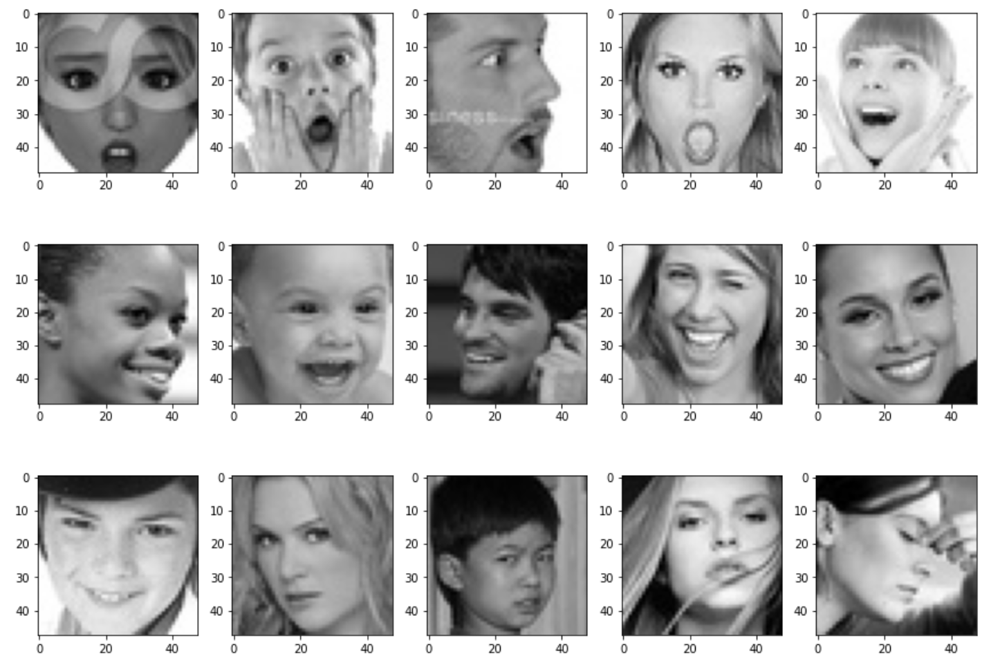

# FacialExpressionRecognition

In this project, we train a Convolutional neural network (CNN) to recognize seven facial expressions: surprise, happiness, anger, digust, fear, neutral, and sad.
The images are 48 x 48 grayscale, and 28708 of them were used for training, while 7178 were kept for validation.

After selecting our best model based on th validation set, we deployed our model via Flask and utilized the openCV library to read in webcam streams or saved videos and carry out real-time facial expression/emotion inference.

The following are some of the images used for training the CNN.

